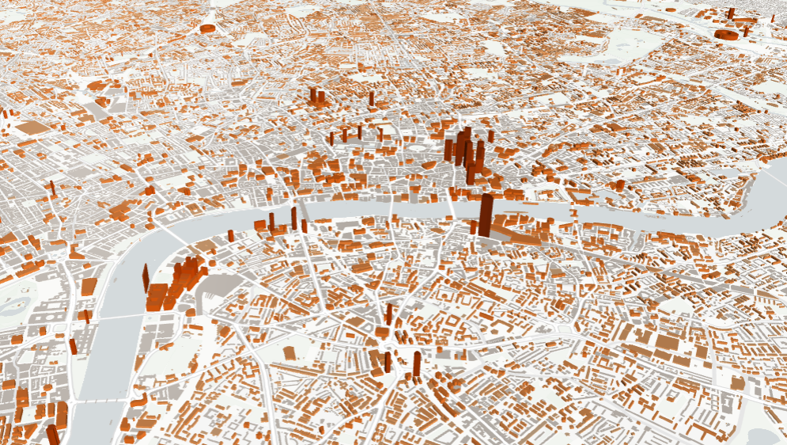

# **ProtocolTitanoboa_Readme**

Hello, welcome to the repository that uses Python for mapping and other projects!

## **Entry 1: Overture Building Heights**

Tutorial Source: [Overture Maps Buildings](https://developmentseed.org/lonboard/latest/examples/overture-maps/)
