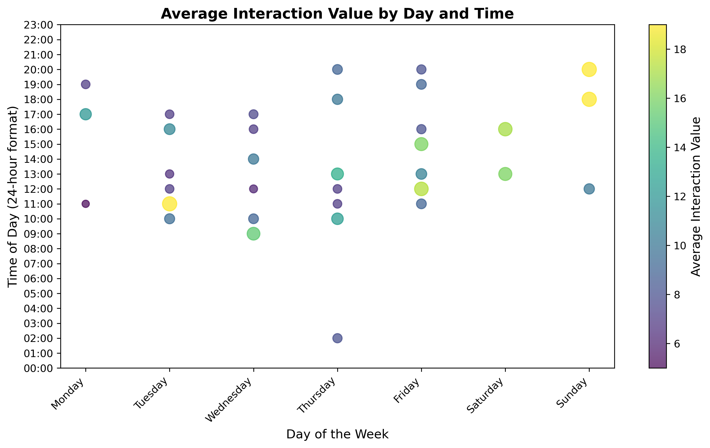

# **ProtocolTitanoboa_Readme**

Hello, welcome to the repository that uses Python for mapping and other projects!

## **Entry 3: Movement Animation**

Tutorial Source: 1. https://leafmap.org/maplibre/animate_point_along_route // 2. https://leafmap.org/maplibre/live_update_feature/

## **Entry 2: Social Media Analysis**

This is a social media analysis of lewisham_communityspace as part of UCL Consultancy Challenge 2024

Tutorial Source: NIL

## **Entry 1: Overture Building Heights**

Tutorial Source: [Overture Maps Buildings](https://developmentseed.org/lonboard/latest/examples/overture-maps/)
